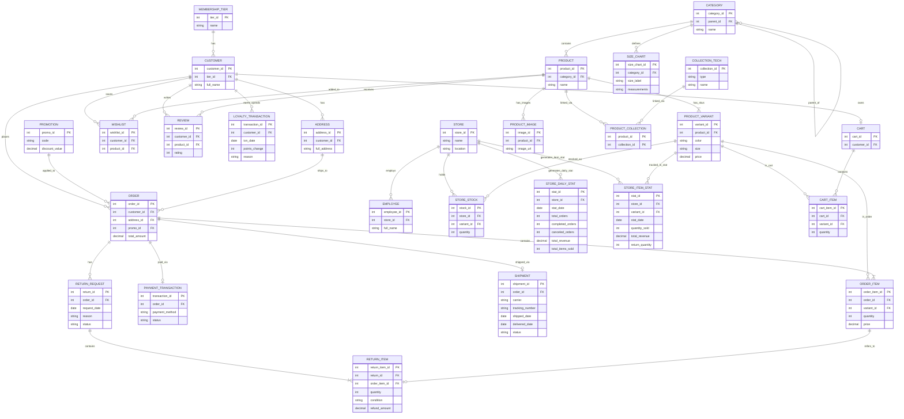

# Cơ sở dữ liệu hệ thống thương mại điện tử thời trang

Dự án này mô phỏng cấu trúc cơ sở dữ liệu (Database) cho hệ thống thương mại điện tử của một chuỗi thời trang, lấy ý tưởng từ mô hình kinh doanh thực tế. Cấu trúc được thiết kế tối ưu với 22 bảng (Tables/Entities), phân chia thành 5 nhóm quản lý chính nhằm đáp ứng các yêu cầu thực tế của một hệ thống bán lẻ đa kênh (Omnichannel).

---

## Danh sách các nhóm và bảng

### Nhóm 1: Khách hàng và Phân quyền (4 bảng)

1. `Customer` (Khách hàng): Lưu thông tin người dùng mua hàng.
2. `Address` (Sổ địa chỉ): Khách hàng có thể lưu nhiều địa chỉ (nhà riêng, công ty).
3. `Membership_Tier` (Hạng thành viên): Chính sách tích lũy điểm lên hạng (Đồng, Bạc, Vàng, VIP).
4. `Employee` (Nhân viên): Tài khoản cho nhân viên quản trị website hoặc nhân viên trực tại cửa hàng vật lý.

### Nhóm 2: Sản phẩm và Phân loại (6 bảng)

5. `Category` (Danh mục): Phân cấp danh mục (Quần áo, Áo thun, Phụ kiện...).
6. `Collection_Tech` (Bộ sưu tập và Công nghệ): Quản lý các dòng vải (AirDry, FlexFit) hoặc bộ sưu tập (Minimalist).
7. `Product` (Sản phẩm chung): Thông tin gốc của sản phẩm.
8. `Product_Collection` (Bảng trung gian): Liên kết nhiều-nhiều giữa `Product` và `Collection_Tech`.
9. `Product_Variant` (Phiên bản - SKU): Cụ thể hóa màu sắc và kích cỡ (ví dụ: áo đen size M, áo trắng size L).
10. `Product_Image` (Hình ảnh sản phẩm): Quản lý hình ảnh đa góc độ của từng sản phẩm.

### Nhóm 3: Tương tác mua sắm (4 bảng)

11. `Cart` (Giỏ hàng): Lưu phiên giỏ hàng của người dùng đang thao tác.
12. `Cart_Item` (Chi tiết giỏ): Các sản phẩm (variant) và số lượng đang nằm trong giỏ hàng.
13. `Wishlist` (Sản phẩm yêu thích): Người dùng lưu lại các mẫu sản phẩm ưng ý để mua sau.
14. `Review` (Đánh giá): Khách hàng phản hồi, chấm điểm (1-5 sao) kèm bình luận sau khi mua.

### Nhóm 4: Đơn hàng và Thanh toán (4 bảng)

15. `Promotion` (Khuyến mãi/Voucher): Quản lý mã giảm giá (ví dụ: SALE10K, FREESHIP), hạn mức, ngày hiệu lực.
16. `Order` (Đơn hàng): Thông tin hóa đơn tổng.
17. `Order_Item` (Chi tiết đơn hàng): Các món hàng cụ thể trong đơn.
18. `Payment_Transaction` (Giao dịch thanh toán): Lưu log từ cổng thanh toán (Momo, VNPay, COD...) gồm mã giao dịch đối soát và trạng thái.

### Nhóm 5: Chuỗi cửa hàng và Tồn kho (4 bảng)

19. `Store` (Cửa hàng): Thông tin các chi nhánh của chuỗi cửa hàng.
20. `Store_Stock` (Tồn kho theo cửa hàng): Quản lý số lượng tồn kho thực tế của từng `Product_Variant` tại từng `Store` (hỗ trợ mô hình Click & Collect).
21. `Store_Daily_Stat` (Thống kê tổng quan cửa hàng theo ngày): Tổng hợp số liệu đơn hàng và doanh thu theo từng ngày cho mỗi cửa hàng.
22. `Store_Item_Stat` (Thống kê mặt hàng theo cửa hàng): Tổng hợp số liệu bán hàng và hoàn trả theo từng variant tại mỗi cửa hàng.

---

## Sơ đồ ERD (Mermaid)

Sơ đồ dưới đây có thể được xem trực quan trên GitHub hoặc bằng cách dán đoạn mã vào [Mermaid Live Editor](https://mermaid.live/).

